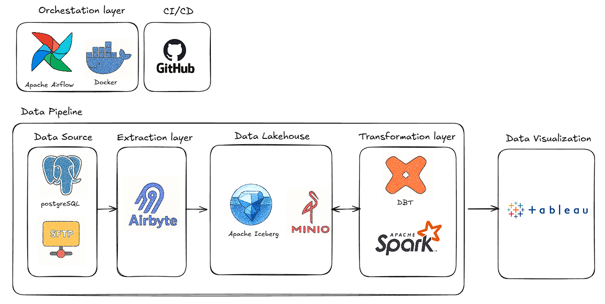

# reconciliation_project
Proof of Concept &lt;> Transactional Reconciliation

## Introduction

This project demonstrates an end-to-end data reconciliation solution for matching transactions between a merchant's records of user payments processed through electronic methods and the corresponding transactions reported by the acquirer bank. The goal is to ensure accuracy, detect discrepancies, and maintain financial integrity in payment processing workflows.

   

The reconciliation process involves comparing transaction data from multiple sources, identifying matches based on key attributes such as transaction IDs, amounts, timestamps, and payment methods. This proof of concept showcases a scalable approach to handling large volumes of transactional data, incorporating data ingestion, transformation, matching algorithms, and reporting.

A graphical representation of the reconciliation flow will be included in future updates to illustrate the step-by-step process.

## Setup

1. Ensure Docker and Docker Compose are installed on your system.

2. Clone or navigate to the project directory.

3. Run the following command to start the services:
   ```
   docker-compose up -d
   ```

   This will start the SFTP server on port 2222, the Postgres database on port 5432, pgAdmin on port 8080, SFTPGo (with web UI) on ports 2022 (SFTP) and 8082 (web), and MinIO on ports 9000 (API) and 9001 (console).

## Airflow Setup with Astro CLI

To orchestrate the reconciliation workflows, this project uses Apache Airflow deployed via Astro CLI.

### Installing Astro CLI

Follow the official installation guide: https://www.astronomer.io/docs/astro/cli/install-cli

### Deploying Airflow with Astro CLI

Follow the develop project guide: https://www.astronomer.io/docs/astro/cli/develop-project

1. **Create a new Astro project:**
   ```
   astro dev init reconciliation-airflow
   cd reconciliation-airflow
   ```

2. **Configure your DAGs:**
   - Add your reconciliation DAGs in the `dags/` folder.
   - Example: Create `dags/reconciliation_dag.py` with tasks for data ingestion, matching, and reporting.

3. **Start the local Airflow environment:**
   ```
   astro dev start
   ```
   This will start Airflow on http://localhost:8080 (note: may conflict with pgAdmin; adjust ports if needed).

4. **Access Airflow UI:**
   - Open http://localhost:8080 in your browser.
   - Default credentials: admin / admin

## Verification

### Accessing the Postgres Database

To verify that the data has been loaded correctly into the Postgres database:

1. **Using pgAdmin (recommended)**: Open http://localhost:8080 in your browser. Log in with email `admin@reconciliation.com` and password `admin`. Add a new server with:
   - **Host**: postgres
   - **Port**: 5432
   - **Database**: reconciliation_db
   - **Username**: admin
   - **Password**: admin

2. Connect to the database using a Postgres client (e.g., psql, pgAdmin, or DBeaver).

   - **Host**: localhost
   - **Port**: 5432
   - **Database**: reconciliation_db
   - **Username**: admin
   - **Password**: admin

3. Alternatively, if you have `psql` installed, run:
   ```
   psql -h localhost -p 5432 -U admin -d reconciliation_db
   ```
   Enter the password `admin` when prompted.

4. Once connected, check the table:
   ```
   SELECT COUNT(*) FROM transactions;
   ```
   This should show the number of rows loaded from `file_postgres.csv`.

5. To view sample data:
   ```
   SELECT * FROM transactions LIMIT 5;
   ```

### Accessing SFTPGo Web UI

SFTPGo provides a web interface for visualizing and manipulating SFTP files. Open http://localhost:8082 in your browser and log in with username `admin` and password `admin`. You can browse, upload, and manage files in the SFTP server.

#### CRITICAL STEP: Create User Correctly

Login: admin / admin

Go to Users → Add user

Configure as follows:

**General**

- Username: `testuser`
- Password: `testpass`

- folder directory: `srv/sftpgo/data_sftp`

**Permissions**

- `*` → ✅ all

### Accessing MinIO

MinIO provides S3-compatible object storage. Access the web console at http://localhost:9001 with username `minioadmin` and password `minioadmin`. The API is available on port 9000.


https://docs.airbyte.com/platform/using-airbyte/getting-started/oss-quickstart